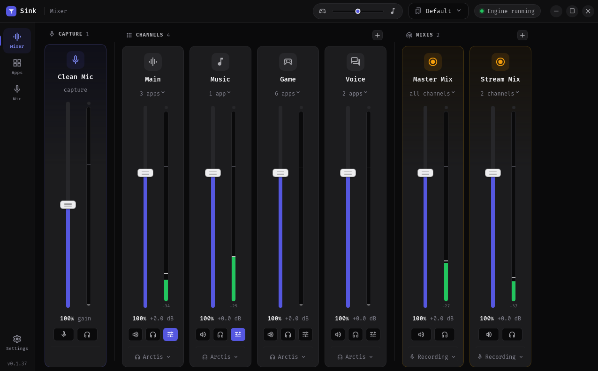
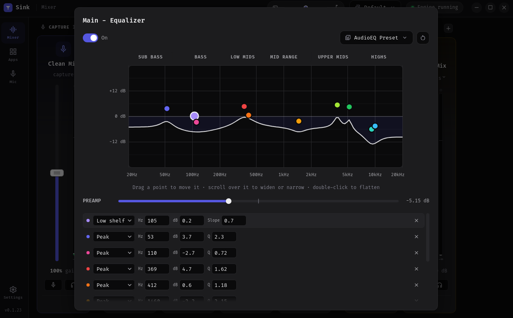
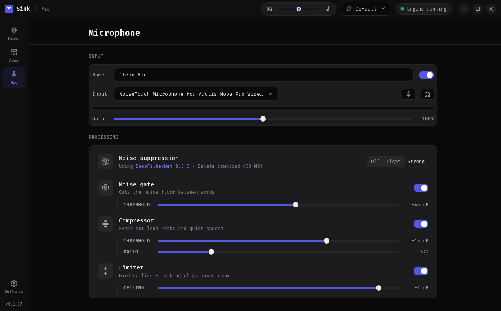
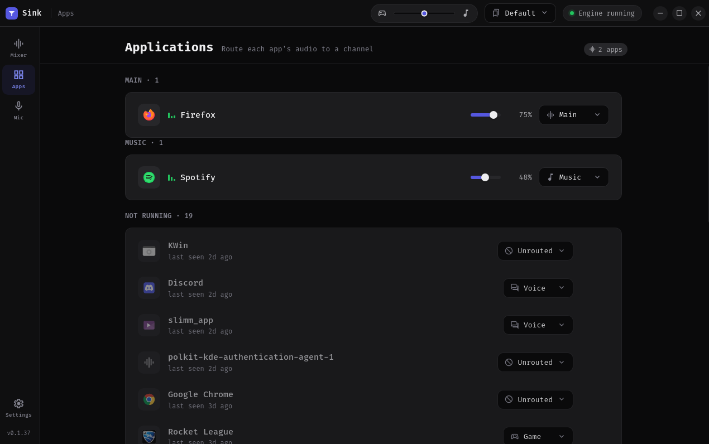
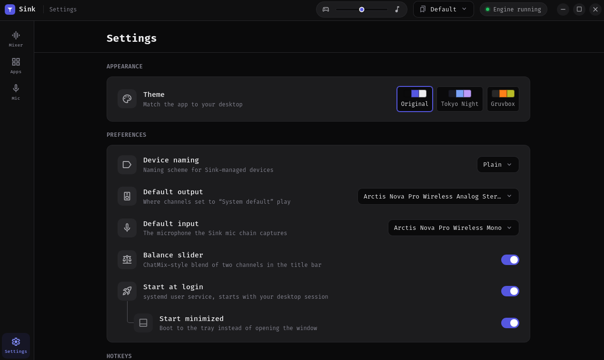

# Sink

It's basically steelseries sonar for linux, built on pipewire.

You make a few channels (game, chat, music, etc), send each app's audio to one of them, and every channel gets its own volume, mute, equalizer and output device.
From there you can build mixes for obs or a recorder, and run your mic through a virtual one for voice chat.



```
 apps ─► channels ─► your ears
              └────► a Mix ─► obs / recorder
```

## How it works

Sink creates the channels as virtual audio devices.
You get game, chat, music and system to start with, and you can add, rename, reorder and delete your own.

Apps show up on the apps page as soon as they play something, and you pick which channel each one goes to.
It remembers that, so the next time the app starts it just lands in the same channel.

Each channel then plays out through the output device you picked for it, or follows your system default.
Config is plain json, so nothing is hidden.

## Features

- **Channels** - per-app routing with volume, mute, meters, and an output device per channel.
  Each one has a listen button, so you can hear just that channel.
- **Apps** - running apps show up on their own, you assign them once and it's remembered.
  Apps that aren't running stay in a list with when they were last seen, and you can ignore the ones you don't care about.
- **Mixes** - recordable sources for obs.
  Master Mix carries everything, and custom mixes can carry "everything except music" and stay current as channels change.
  A mix can also carry your processed microphone, so one input device holds your voice plus app audio (a sonar style Stream Mix).
  Each member gets its own send level and mute inside the mix, which is what recorders hear and is independent of your own volume.
  You can pop out a mix's levels from its strip.
  In obs, add a mix as an audio input, not Desktop Audio.
  A mix can also sit with the output devices instead if you would rather keep your recording list short, and it stays capturable through its monitor.
- **Equalizer** - per-channel parametric EQ (up to 10 bands) with a draggable response curve and bundled community presets.
  It imports and exports presets too, including AutoEq text blocks.
- **Microphone** - a virtual mic you select in discord or obs, named whatever you want.
  Your input goes through noise suppression, a noise gate, a compressor and a limiter, in that order.
  There's a button to listen to yourself while you tune it.
- **Noise suppression** - Off, Light or Strong.
  Light is rnnoise and it's built in, so it's basically free.
  Strong is deepfilternet and it does better on keyboards and loud fans, but it's a 53 MB download and sink asks before it fetches anything.
  See [Noise suppression](#noise-suppression) below for the numbers.
- **Balance slider** - a chatmix style slider in the title bar that blends between two channels, game and chat by default.
- **Hotkeys** - global shortcuts for the next and previous profile and for the balance slider.
  They need a desktop with the global shortcuts portal (kde plasma, recent gnome, hyprland) or an x11 session.
- **Profiles** - save and switch full layouts from the title bar or the tray.
- **Themes** - Original, Tokyo Night, or Gruvbox Dark, to match the rest of your desktop.






## Noise suppression

The two modes are pretty different in what they cost, so here's roughly what you get.
These are from my machine (a ryzen 9 9950x3d), so an older cpu will use more.
The delay is what each mode adds compared to having suppression off, measured by playing the same file through each one.

| | Light | Strong |
| --- | --- | --- |
| Engine | [rnnoise](https://github.com/jneem/nnnoiseless) | [deepfilternet](https://github.com/Rikorose/DeepFilterNet) |
| Download | none | 53 MB, once |
| cpu | about 0.3% of one core | about 10% of one core |
| ram | nothing noticeable | about 150 MB |
| Added delay | about 20 ms | about 40 ms |

Picking Strong the first time shows a prompt with the size and where it comes from, and nothing downloads until you say yes.
The file is checked against a fixed hash before sink uses it, so a bad download is just thrown away.
It runs in its own process, which means if it ever can't keep up sink falls back to Light and you can pick Strong again to retry.

The download goes in `~/.local/share/sink/plugins`, and it stays there when you update sink.
The Mic screen has a delete link if you want the space back.
If you already have deepfilternet's ladspa plugin installed (easyeffects people usually do), sink uses that and skips the download.
The download is x86_64 only for now, since that's the only build sink has a hash for, and it needs curl or wget.

## Install

**Arch / Manjaro / EndeavourOS** - from the [AUR](https://aur.archlinux.org/packages/sink-bin):

```bash
yay -S sink-bin      # or: paru -S sink-bin
```

**Fedora** - from [COPR](https://copr.fedorainfracloud.org/coprs/nc1107/sink/):

```bash
sudo dnf copr enable nc1107/sink
sudo dnf install sink
```

Both track new releases, so you update through your package manager like any other package.

Otherwise, grab the latest from [Releases](https://github.com/NC1107/sink/releases) and install the file directly.

**Fedora / openSUSE**

```bash
sudo dnf install ./sink-*.x86_64.rpm
```

**Debian / Ubuntu / Mint**

```bash
sudo apt install ./sink_*_amd64.deb
```

**Arch / Manjaro / EndeavourOS**

```bash
sudo pacman -U ./sink-bin-*-x86_64.pkg.tar.zst
```

These install the app properly, with a launcher entry, an icon, and uninstall through your package manager.

**Any other distro - AppImage (portable, no root)**

```bash
chmod +x sink_*_amd64.AppImage
./sink_*_amd64.AppImage
```

To get a launcher entry for an AppImage, use [Gear Lever](https://flathub.org/apps/it.mijorus.gearlever) or AppImageLauncher.

Requires pipewire with `pipewire-pulse` and wireplumber 0.5+, which is the default on most current distros.

## Things to know

- Config lives in `~/.config/sink` as plain json.
- On webkitgtk 2.54 and newer the window has square corners.
  That version stopped painting see-through windows on some graphics setups (nvidia on wayland so far), so sink runs opaque there instead of showing a blank window.
  Older versions keep the rounded corners, and [#90](https://github.com/NC1107/sink/issues/90) tracks getting them back.

## Build

```bash
npm install
npm run tauri dev      # run
npm run tauri build    # package
```

Tests are `npm test` for the frontend and `cargo test` from `src-tauri` for the rust side.
CI checks formatting too (`cargo fmt` and `prettier`), so run both before you push.
Every pull request also builds a .deb, .rpm and AppImage you can download from its run in the Actions tab, if you want to try a change before it's merged.

## Contact

If you need help or run into something broken, the discord is the fastest way to reach me.

[](https://discord.gg/jUMuSxGf6q)

Thanks to everyone listed in [CONTRIBUTORS.md](CONTRIBUTORS.md).

## License

[GPL-3.0](LICENSE)
